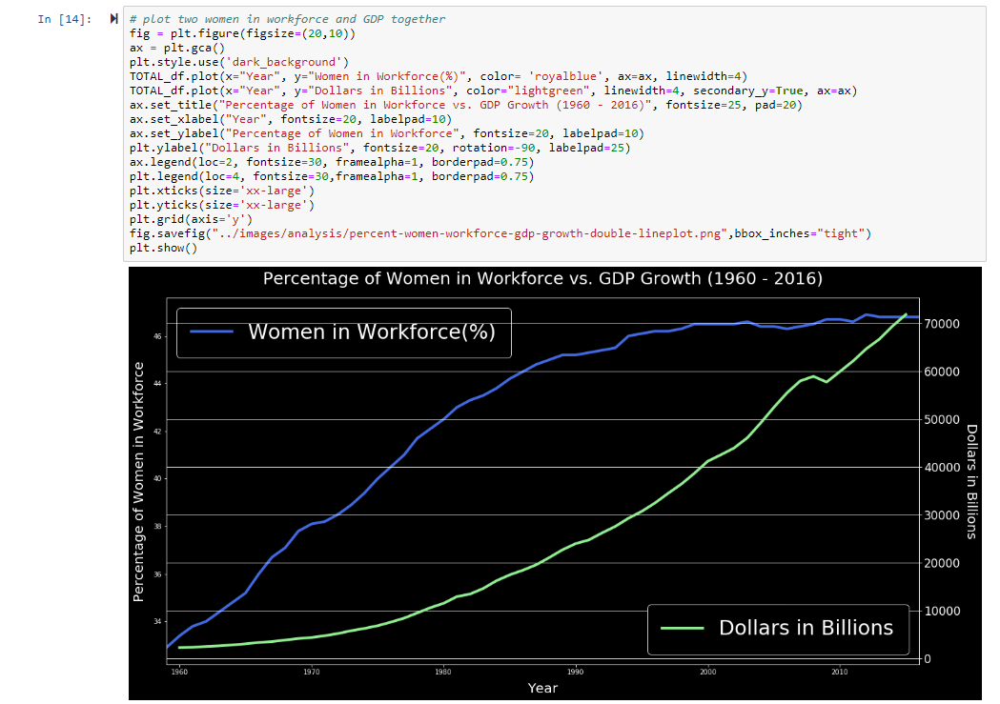
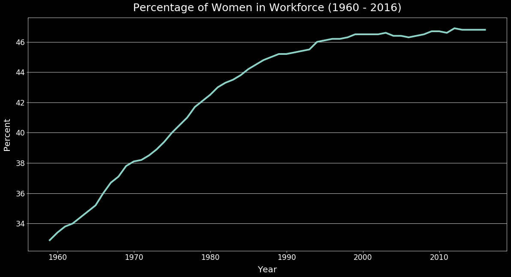
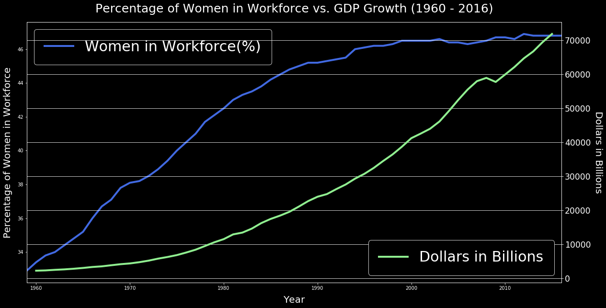
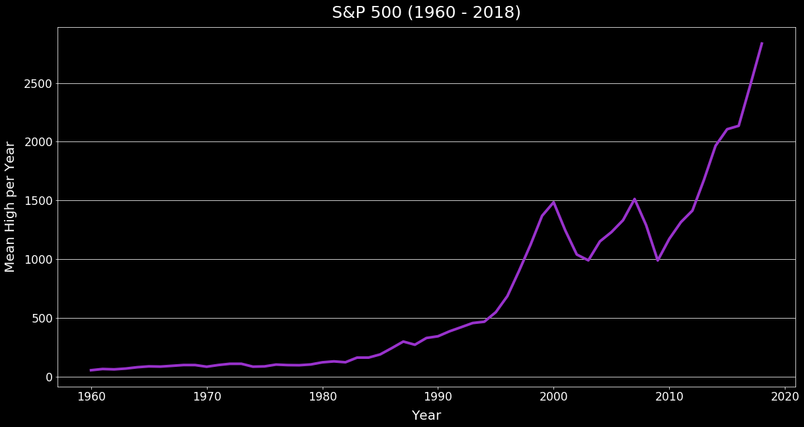
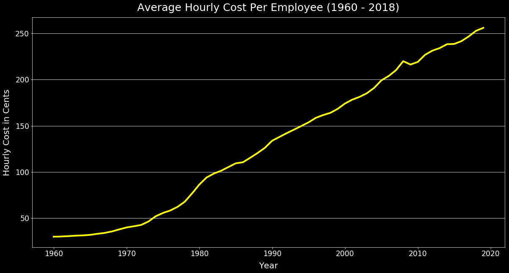
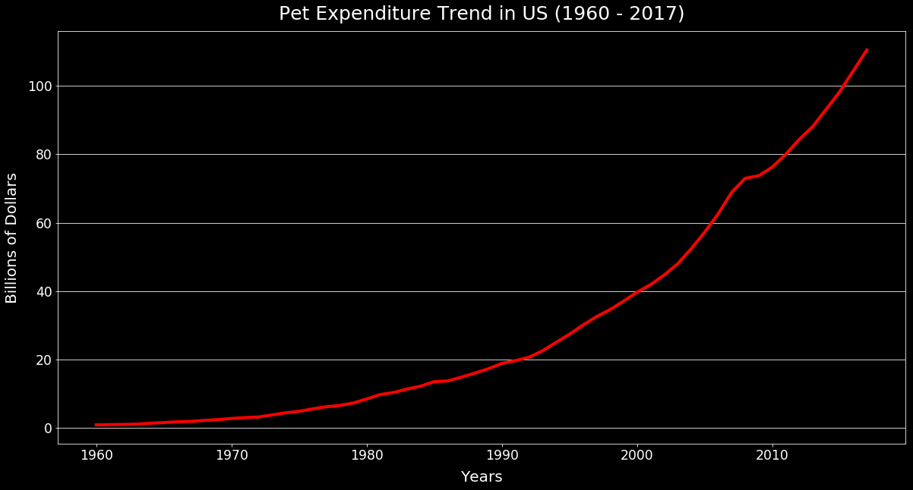

# Women in the Workforce Data Analysis

Image source: hackbrightacademy.com

### Contributors

Tamara Najjar, Mohammed Sajid Khan, and Kathleen Graham

### Project Proposal

Overview:

Since the 1960s, there has been a noticeable influx of women in the workforce. There are a number of variables that have been impacted by an increased percentage of women in the workforce and in this presentation we will discover what those variables are. 

Questions:

* What are the effects of increased women in the workforce?

* How has the GDP been impacted (if at all)?

* How has the birth rate been impacted (if at all)?

* How does this data vary by region?

* Are there other unrelated societal changes that could potentially mimic the same trends?

### Exploration

We began our exploration on the [U.S. Department of Labor](https://www.dol.gov/)'s website. We also found some finance websites such as [Federal Reserve Bank of St. Louis, Eighth District](https://fred.stlouisfed.org) and [Yahoo Finance](https://yhoo.it/2XJ4JvL). Eventually, we discovered numerous data sets from the [Institute for Women's Policy Research](https://statusofwomendata.org) and a relevant API through the [Bureau of Labor Statistics](https://catalog.data.gov/).

### Resources

For this analysis, we used Jupyter Notebook, Python, pandas, NumPy, and Matplotlib.

Our favorite resources for researching how to solve issues while cleaning up data and plotting:

* [Geeks for Geeks](https://www.geeksforgeeks.org/python-programming-language/)
* [Stack Overflow](https://stackoverflow.com/)
* [Matplotlib Documentation](https://matplotlib.org/)
* [The Python Graph Gallery](https://python-graph-gallery.com/)

### Overview of Clean Up Process

“If you torture the data long enough, it will confess.” ― Ronald H. Coase, *Essays on Economics and Economists*

The overall process for cleaning our data was simple, but there were a few unexpected issues that took significantly more time to solve. We didn't want to torture our data, so we first followed typical clean up procedures and simple line plots for time series. Unexpected issues arose when trying to plot two separate time series together, when different types or lengths were used within the same data frame, or when different types were nested within each other.

Most of our data sets included one of the following issues:

* Mapping column names
* Dropping rows that were unnecessary, incomplete, or skewing plotting
* Parsing through API requests
* Parsing through dates to get years
* Changing strings to integers or floats
* Creating secondary y axes
* Manipulating legends
* Changing tick locations and size

### Expected Cleanup

Most of the data sets were messy and many had more information than needed or not enough information, so we dropped blank or unnecessary rows before plotting in order to see the true meaning of the data. Occasionally, dropping was required due to the wrong type of data in place of no data recorded for certain demographics.

For example, when observing the increased participation rate of women in the workforce grouped by race, we couldn't plot properly because some of the rows had string placeholders ('-') instead of NA or the integer 0. We had to make separate data frames for each race and then drop the rows that were distorting the plot. Then we were able to plot all together.

### Unexpected Cleanup

Parsing the requests obtained through an API and plotting a secondary y axis were two of our most interesting problems we solved while cleaning and plotting our data.

#### Parsing API requests

Our API calls could only be made 10 at a time. We put these calls into six different data frames only to realize that the data frames were extremely nested.

#### Solution to nested lists and dictionaries in API requests

Upon looking at the types and lengths, we were able to create loops to go through the requests and append certain information to lists that could be placed into a new data frame. There was not much help on the internet about this issue, so it took some time to realize the lists and dictionaries were densely nested. Thinking through how we would extract the pertinent information manually helped us to decide on using loops to append the data appropriately.

#### Plotting a secondary y axis

We researched some examples of secondary y axis plots on Stack Overflow and decided to use plt.subplots() and fig, ax. This created unintended consequences, such as plotting two separate legends and manipulating their locations and sizes as best we could.

### Analysis

#### Participation of Women in the Workforce Has Increased

#### Birth Rates Have Declined

#### GDP Has Grown

#### GDP Has Grown in Different States

#### Women in the Workforce vs. GDP Growth

#### S and P 500 Increase

#### Average Cost Per Employee Has Increased

#### Women in the Workforce by Race

#### Women in the Workforce by Age

#### Women in the Workforce Are Still Having Children

#### Women Are Returning to Workforce After Having Children

#### Pet Expenditure Has Increased

Although there are many factors that affect women participation in the workforce, birth rates, and GDP growth as well as many effects of these events, we still found some interesting trends such as the increase in pet expenditure. Pets are definitely cheaper than children!

### Further Analysis

If we had more time, we would:

* Dive into the demographics of pet owners (i.e. age, income, etc.)
* Identify what other factors have contributed to increased pet expenditure.
* Explore additional functionality of python, pandas, numpy, matplotlib, and other libraries.
* Explore ways to present more data at one time (i.e. state data over time).
* Explore what other factors have contributed to a declining birth rate (i.e. accessibility to birth control).
* Explore what other factors have contributed to an increase in GDP (i.e. technology/automation).
* Explore additional effects of increased women in the work place (i.e. divorce rates, average age of women at marriage, etc.)
* Explore if there are any contributing health factors to increased women in the work place (i.e. mental health, physical health, etc.)

### Notebooks, Presentation, and Summary

View our [presentation](https://docs.google.com/presentation/d/1akMttnb3DYK5BZcfBKQVOkY6KCYCHzIfGxf0XBLjgrk/edit?usp=sharing) or read through our [summary](analysis/summary-women-in-workforce.docx), [data exploration and cleanup notebook](cleanup/data-exploration-and-cleanup.ipynb), and [analysis notebook](analysis/women-in-workforce-analysis.ipynb) detailing our exploration and plotting process.