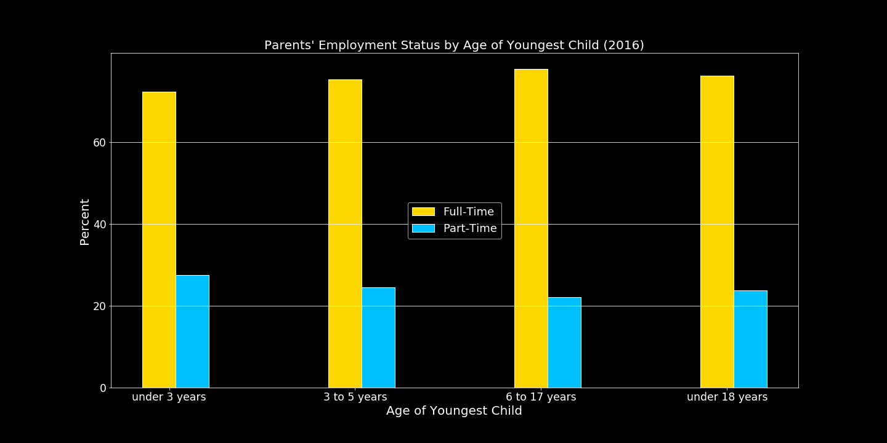

# Women in the Workforce Data Analysis

Image source: hackbrightacademy.com

#### Contributors

Tamara Najjar, Sajid Khan, Kathleen Graham

#### Project Proposal

Overview:

Since the 1960s, there has been a noticeable influx of women in the workforce. There are a number of variables that have been impacted by an increased percentage of women in the workforce and in this presentation we will discover what those variables are. 

Questions:

* What are the effects of increased women in the workforce?

* How has the GDP been impacted (if at all)?

* How has the birth rate been impacted (if at all)?

* How does this data vary by region?

* Are there other unrelated societal changes that could potentially mimic the same trends?

#### Data Sets and Scope

Our data sets are from the following sources:
* [U.S. Department of Labor Women's Bureau](https://www.dol.gov/wb/stats/stats_data.htm)
* [Institute for Women’s Policy Research](https://statusofwomendata.org/explore-the-data/)
* [source3]()
* [source4]()
* [source5]()

Scope:

#### Conclusions

A few explorations we enjoyed:

**Women in the Workforce vs. GDP Growth**

**Women in the Workforce by Age**

**Employment Status of Women in the Workforce by Age of Youngest Child**

**Pet Expenditure Is Increasing**

Although there is a wide range of factors that affect women participation in the workforce, birth rates, and GDP growth, we still found some interesting trends such as the increase in pet expenditure. Pets are cheaper than children!

#### Post Mortem

If we had more time, we would:

* Explore what other factors have contributed to a declining birth rate.

* Explore what other factors have contributed to an increase in GDP.

* Dive into the demographics of pet owners.

* Identify what other factors have contributed to increased pet expenditure.

* Explore urbanization and how it relates to women in the workforce.

#### Presentation

*ppt will be uploaded into a google drive file to link here and make it easily viewable in web browser*

